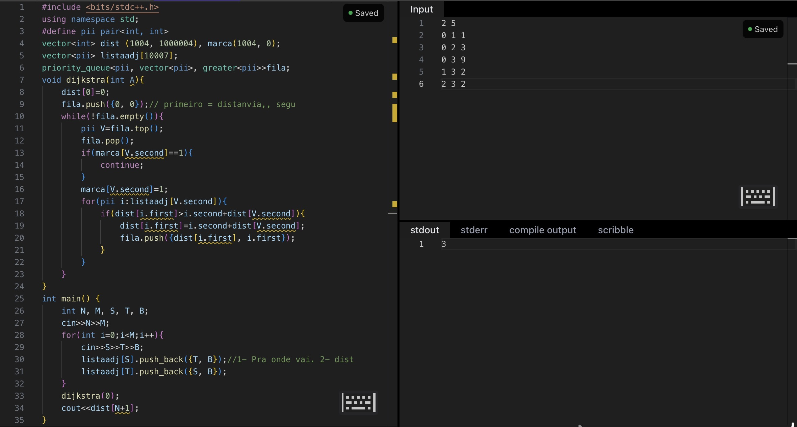

# Menor-caminho
calcula a menor distância necessária para percorrer um grafo em que as arestas tem peso positivo utilizando o algoritmo de Dijkstra.

## Demonstração

## Instalação e pré-requisitos
1. Clone o repositório.
2. Acesse a pasta do projeto.
3. Compile o código, substituindo main.cpp pelo nome real do arquivo.
Para executar o projeto, é necessário ter:
* Um compilador C++.
* Um terminal ou ambiente de desenvolvimento.
* Git, caso deseje clonar o repositório.

## Uso e exemplos
O programa recebe:
* N: quantidade de vértices.
* M: quantidade de arestas.
* S e T: vértices conectados por uma aresta.
* B: peso da aresta.
Cada aresta é adicionada nos dois sentidos, representando um grafo não direcionado.

### Exemplo de entrada
- 2 5
- 0 1 1
- 0 2 3
- 0 3 9
- 1 3 2
- 2 3 2
- Saida: A menor distância do vértice 0 ao vértice 3 é igual a 3, pelo caminho 0-1-3.

## Estrutura do projeto
* README.md: documentação do projeto.
* LICENSE: arquivo com os termos de uso e distribuição.
* main.cpp: código-fonte do programa.
* IMAGENS: pasta com imagens utilizadas na documentação.

## Licença
Este projeto está licenciado sob a [Licença MIT](LICENSE).